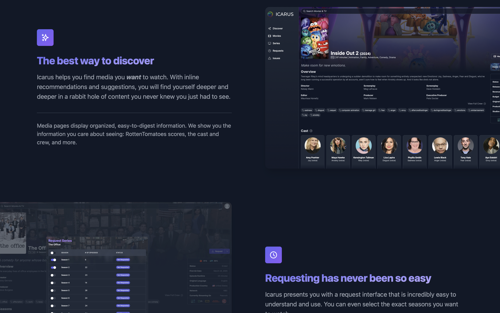
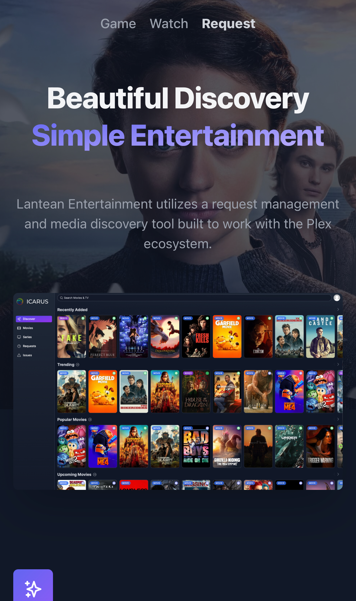

# Icarus - Media Server Website

Welcome to **Icarus**, the official media server website of LanteaCorp! This website serves as the central hub for streaming and managing content from the Icarus Plex media server.

## Features

- **Media Collections**: Browse through movie, TV, and music collections.
- **Search & Filter**: Easily find media by title, genre, rating, or year.
- **Responsive Design**: Optimized for desktop and mobile devices.

## Preview

*Icarus homepage showcasing the featured media collections.*

*A glimpse of a movie details page.*

*Responsive mobile layout for on-the-go media browsing.*

## Installation

To set up the project, follow the standard installation procedure for web projects.

## Usage

Once installed, you can:

- Update links to direct to your own docker instance of Icarus Request.
- Update images to match your instance.
- Background automatically updates with current images from theMovieDB, simply add your own API key.

## Contributing

If you’d like to contribute to the development of this website, feel free to open a pull request or issue on the [GitHub repository](https://github.com/Anqui3tas/Icarus/issues).

## License

This project is licensed under the MIT License - see the [LICENSE.md](LICENSE.md) file for details.

---

**Icarus Media Server**  
Powered by LanteaCorp
Visit us at [icarus.lanteacorp.com](https://icarus.lanteacorp.com)